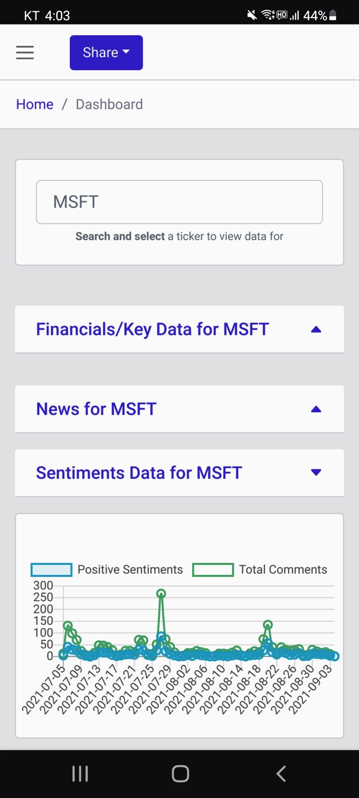
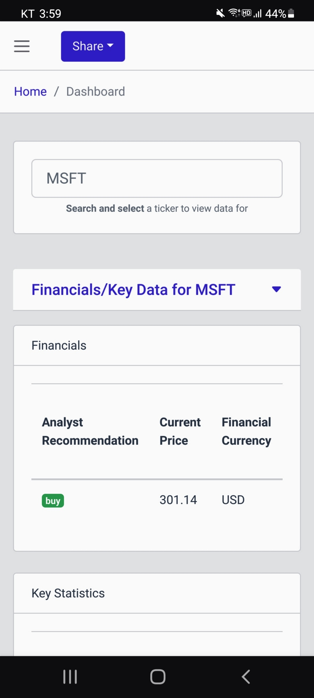
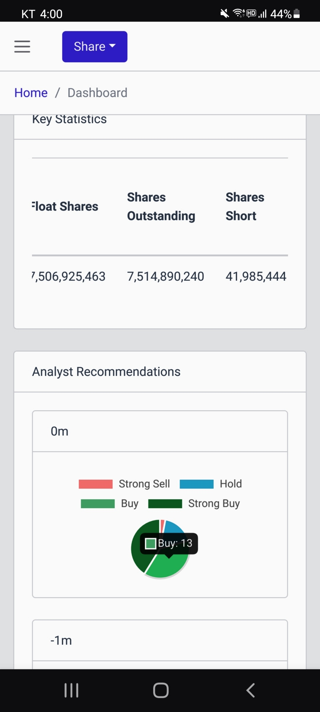
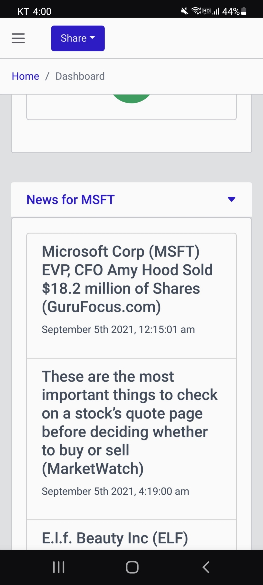
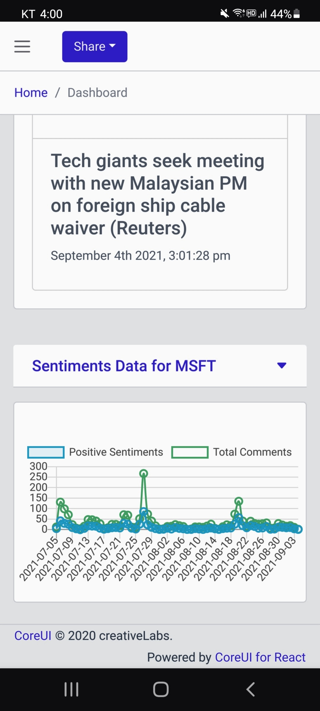
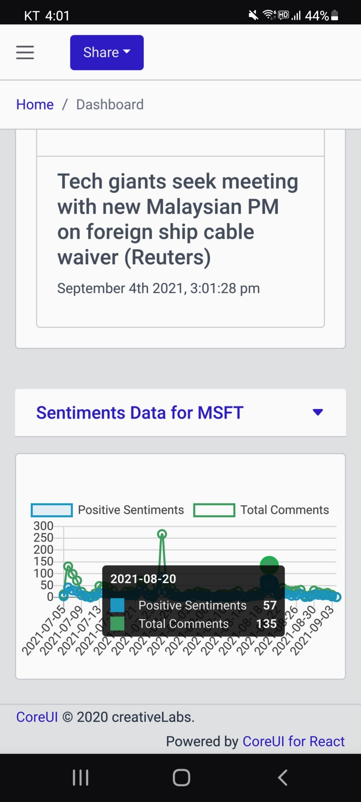
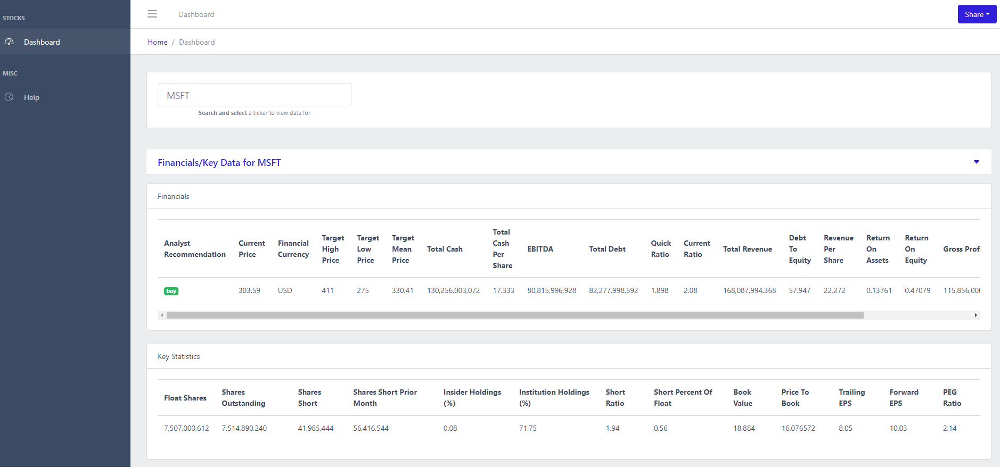
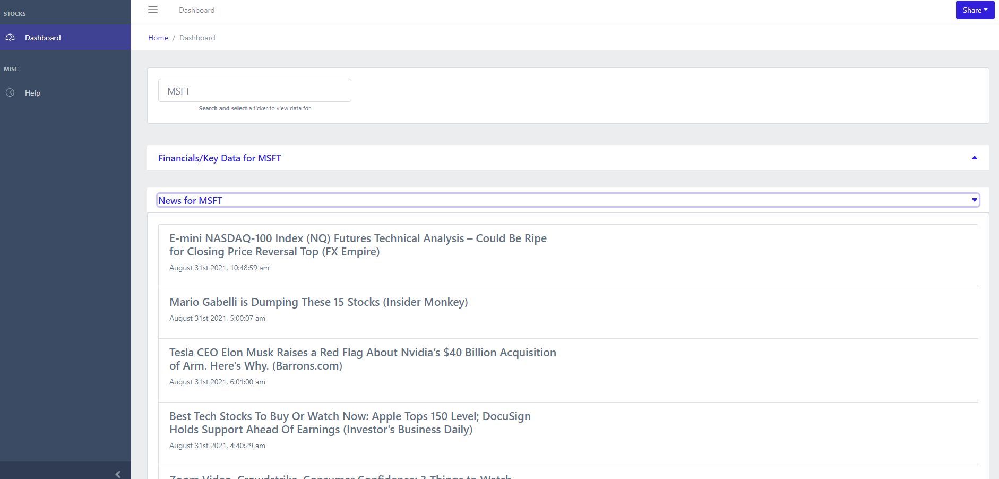
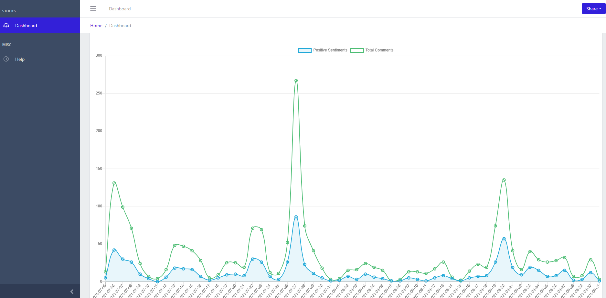

# Chartbeyond

[Chartbeyond](https://chartbeyond.com) website is no longer in use.

Real-time stock sentiment analysis web application.

### Features
* Search stocks listed in in NASDAQ and NYSE
* Get a look at financials and key data on stocks
* Take a look at recent news on stocks
* View sentiments on stocks

### Mobile (Samsung S20)

<table border="1" width="100%">
    <tr>
        <td></td>
        <td></td>
        <td></td>
    </tr>
    <tr>
        <td></td>
        <td></td>
        <td></td>
    </tr>
    
</table>

### Desktop

